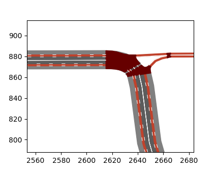

# SumoNetVis
A Python library for visualizing a Sumo network and trajectories with matplotlib.




Basic trajectory plotting from FCD outputs is built in, but it is also possible to plot custom data and graphics on
top of the network with the full flexibility and power of matplotlib and other compatible libraries, such as seaborn.

## Installation
Simply download this repository to your working directory. You can then import the library with the following line:

```python
import SumoNetVis
```

If you have problems with your IDE's autocomplete feature, use this instead:

```python
try:
    import .SumoNetVis
except Exception:
    import SumoNetVis
```

### Dependencies
* shapely
* matplotlib
* numpy

## Usage
To plot a Sumo net file and trajectories, you can use the following code:

```python
import SumoNetVis
import matplotlib.pyplot as plt
# Plot Sumo Network
net = SumoNetVis.Net("path/to/yourfile.net.xml")
fig, ax = plt.subplots()
net.plot(ax)
# Plot trajectories
trajectories = SumoNetVis.Trajectories("path/to/fcd-output.xml")
trajectories["vehicle_id"].assign_colors_speed()
trajectories["vehicle_id"].plot(ax)
# Show figure
plt.show()
```

## Contribution
Issues and pull requests are welcome.
