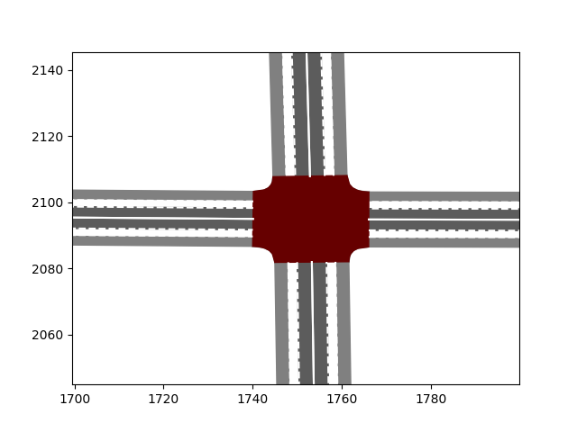
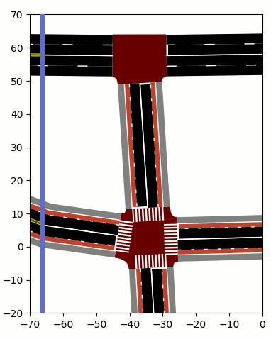
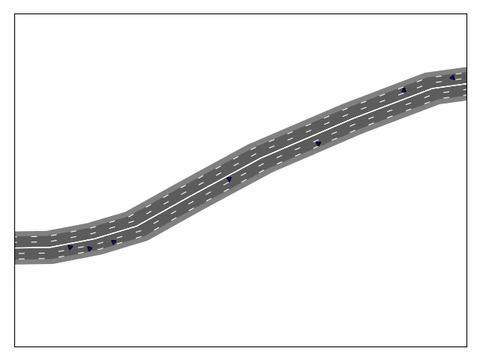
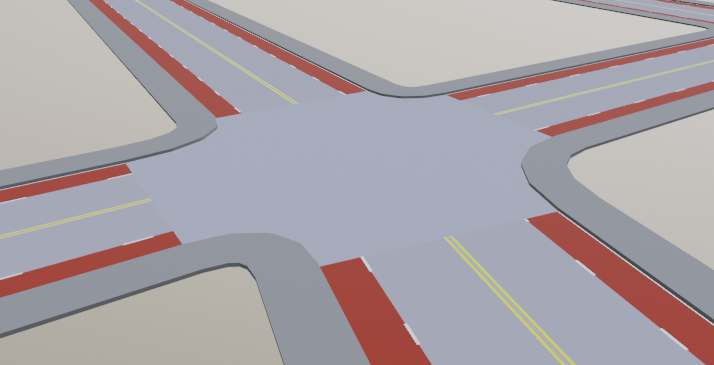

# SumoNetVis
A Python library for visualizing a Sumo network and trajectories with matplotlib or as an OBJ file.





Basic trajectory plotting from FCD outputs is built in, but it is also possible to plot custom data and graphics on
top of the network with the full flexibility and power of matplotlib and other compatible libraries, such as seaborn.

3D geometry for a network can be generated and saved as a Wavefront-OBJ file.


## Installation
This package can be installed via pip with the command ```pip install SumoNetVis```.
You can then import the library with:

```python
import SumoNetVis
```

### Dependencies
* shapely (>=1.7.0 for stop lines and OBJ export)
* matplotlib
* numpy

## Usage
To plot a Sumo net file and trajectories, you can use the following code:

```python
import SumoNetVis
import matplotlib.pyplot as plt
# Plot Sumo Network
net = SumoNetVis.Net("path/to/yourfile.net.xml")
net.plot()
# Plot trajectories
trajectories = SumoNetVis.Trajectories("path/to/fcd-output.xml")
trajectories["vehicle_id"].assign_colors_speed()
trajectories["vehicle_id"].plot()
# Show figure
plt.show()
```

the ```Net.plot()``` function takes the following optional parameters:
* ax: matplotlib Axes object (defaults to currently active Axes)
* clip_to_limits: if True, only objects visible in the current view extents will be drawn
* zoom_to_extents: auto-zoom to Net extents (defaults to True)
* style: lane marking style to use ("USA" or "EUR")
* stripe_width_scale: scale factor for lane marking widths (defaults to 1)
* plot_stop_lines: whether to plot stop lines
* lane_kwargs: dict of kwargs to pass to the lane plotting function (matplotlib.patches.Polygon()), for example alpha
* lane_marking_kwargs: dict of kwargs to pass to the lane markings plotting function (matplotlib.lines.Line2D())
* junction_kwargs: dict of kwargs to pass to the junction plotting function (matplotlib.patches.Polygon())

Any kwargs passed directly to ```Net.plot()``` will be passed to each of the plotting functions. These will, however,
be overridden by any object-type-specific kwargs (```lane_kwargs```, etc.).

To plot all junctions at 50% opacity and all other objects at 80% opacity, for example, one can use:
```python
net.plot(junction_kwargs={"alpha": 0.5}, alpha=0.8)
```

The color scheme of junctions and various lane types can be customized by modifying entries in the global variable
```COLOR_SCHEME```. For example, to plot bike lanes as dark green instead of dark red, do the following:
```python
SumoNetVis.COLOR_SCHEME["bicycle"] = "#006600"
```
Any color specification supported by matplotlib can be given here, such as RGB and RGBA hex strings and float tuples, as
well as color names and abbreviations. See the matplotlib documentation for more detailed information.

### Animation
Instead of visualizing Trajectories as lines, an animation can be generated using the ```matplotlib.animation``` module.

```python
import matplotlib.animation as animation
trajectories = SumoNetVis.Trajectories("path/to/fcd-output.xml")
fig, ax = plt.subplots()
a = animation.FuncAnimation(fig, trajectories.plot_points, frames=trajectories.timestep_range(), repeat=False,
                            interval=1000*trajectories.timestep, fargs=(ax,), blit=True)
plt.show()
```

The plot settings for each vehicle can be customized and the color of each point can be animated, as shown in the
following example.

```python
for trajectory in trajectories:
        trajectory.assign_colors_speed()
        trajectory.point_plot_kwargs["ms"] = 8  # set marker size. Can set any kwargs taken by matplotlib.pyplot.plot().
```

In order to animate the color of the points based on the assigned color scheme, an additional farg must be passed
when creating the animation.

```python
a = animation.FuncAnimation(fig, trajectories.plot_points, frames=trajectories.timestep_range(), repeat=False,
                            interval=1000*trajectories.timestep, fargs=(ax, True), blit=True)
```

### OBJ Export

The Wavefront-OBJ format is a text-based file format. The ```Net.generate_obj_text()``` method generates the contents
of this file for the given Sumo network. In order to save an OBJ file, do the following:

```python
with open("model.obj", "w") as f:
    f.write(net.generate_obj_text())
```

The axis configuration in the generated file is Y-Forward, Z-Up. Check these settings if the orientation of the model
is incorrect when importing the file into a 3D modelling program.

Each type of object is defined with a corresponding material (i.e. all bike lanes have the same material, all sidewalks,
and so on), making it easy to quickly set the desired material properties before rendering.

## Documentation
API documentation can be found [here](https://patmalcolm91.github.io/SumoNetVis/SumoNetVis.html)

## Contribution
Issues and pull requests are welcome.
